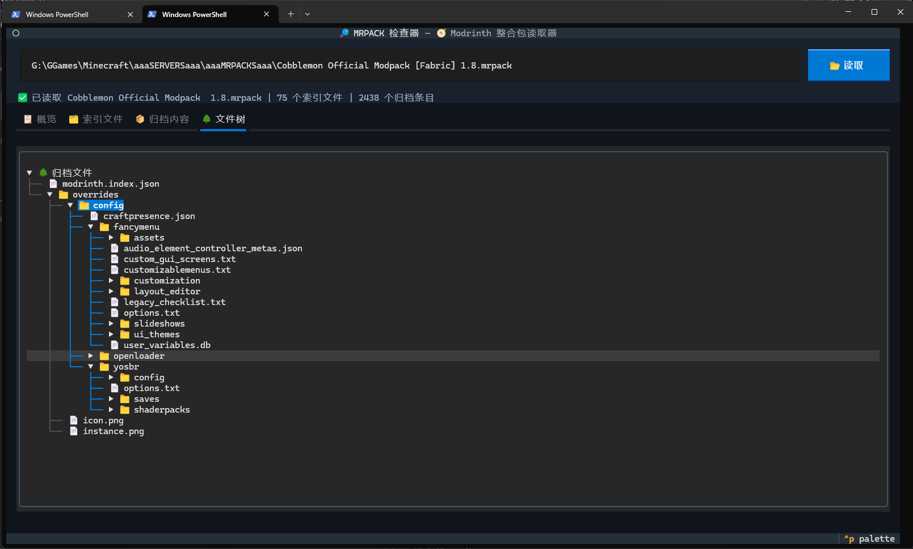

# 🌳 MRPACK TUI Inspector

[](https://pypi.org/project/read-mrpack-tui/)
[](https://pypi.org/project/read-mrpack-tui/)

> [](https://support.modrinth.com/en/articles/8802351-modrinth-modpack-format-mrpack)
>
> [点我查看 Modrinth 官网的 MRPACK 格式文档。](https://support.modrinth.com/en/articles/8802351-modrinth-modpack-format-mrpack)

> A Textual terminal interface for reading and browsing Modrinth `.mrpack` modpacks.

> **[📖 English](README.en-us.md)**
> **[📖 简体中文(大陆)](README.md)**
> **[📖 繁體中文(台灣)](README.zh-tw.md)**

## ✨ Features

- 📦 View pack metadata, dependencies, Modrinth indexed files, and archive root statistics.
- 🌳 Browse the complete ZIP file tree, with directories collapsed by default for large modpacks.
- 🔎 Search the file tree by file name, folder name, or bounded UTF-8 text content, then navigate matches with previous/next buttons, arrow keys, or W/S.
- 🔍 Filter indexed files by path, environment side, or download URL.
- 🌐 Support Simplified Chinese, Traditional Chinese, and English.

## 🚀 Usage

💡 Requirement: Python 3.11 or newer and [uv](https://docs.astral.sh/uv/).

```powershell
uvx --refresh read-mrpack-tui
```

📂 Pass an absolute modpack path directly:

```powershell
uvx --refresh read-mrpack-tui "D:\Minecraft\modpacks\example.mrpack"
```

🌐 Select a display language:

```powershell
uvx --refresh read-mrpack-tui --lang en-us "D:\Minecraft\modpacks\example.mrpack"
```

## 🛠️ Development

```powershell
uv sync
uv run read-mrpack-tui "D:\Minecraft\modpacks\example.mrpack"
```

## 🖼️ Preview

### 📦 Overview


### 🗂️ Indexed Files


### 🌳 File Tree



### 🗃️ Archive Contents


## 📄 License

This project is licensed under the [MIT License](LICENSE).
